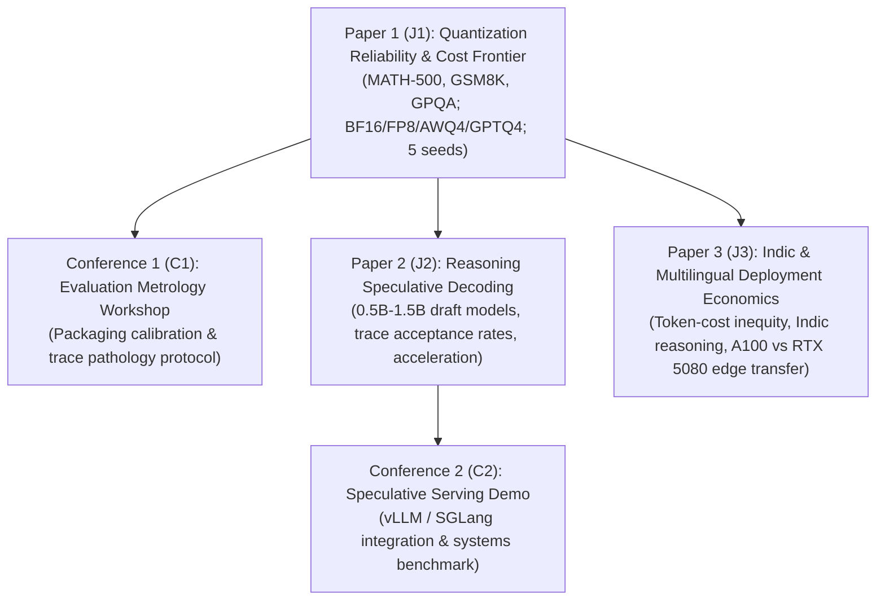
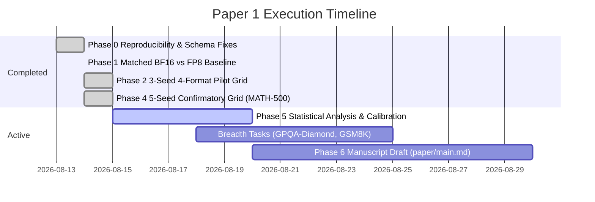

# AGENTS.md — PhD Master Operating System & Memory
**Scholar:** Manish Nandish, IIT Patna  
**Cluster:** PARAM Rudra HPC (C-DAC / NSM), NVIDIA A100 80GB GPUs  
**Repository:** `/scratch/manishn_iitp/reasoning-compression-lab`  
**GitHub:** [https://github.com/Manish06N/reasoning-compression-lab](https://github.com/Manish06N/reasoning-compression-lab)  
**Last Updated:** 2026-08-15 (Post-40-Cell Confirmatory Campaign Completion)

---

## 1. Executive Summary & Thesis Spine

### PhD Thesis Title (Frozen)
> **"Reliable and Cost-Efficient Deployment of Reasoning LLMs under Compression, Evaluation, and Multilingual Constraints"**

### Degree Constraints & Mandate
- **Target Requirements:** 3+ first-author Q1/Q2 journal articles (Scopus/SJR / JCR) + 2 peer-reviewed conference/workshop papers.
- **Timeline:** ~2 years remaining (Degree completion target: 2027/2028).
- **Execution Mode:** Distance mode, flexible supervisor; highly disciplined self-driven execution, public reproducible artifacts, and rigorous statistical controls.

### 3-Journal + 2-Conference Publication Strategy



| Output | Type | Title / Focus | Target Venues (Verify Q1) | Hardware / Stack | Status / Target Date |
|---|---|---|---|---|---|
| **J1** | Main Journal | *Beyond Pass@1: Reliability–Cost Frontiers of Quantized Reasoning Models under Controlled Serving-Stack Shift* | *Future Generation Computer Systems (FGCS)*, *Journal of Systems and Software (JSS)*, *Neurocomputing* | HPC 2× A100, `qrm-official` (vLLM 0.7.0 eager) | **Headline 40-cell grid completed (2026-08-15)**; Phase 5 analysis & draft in progress |
| **C1** | Conference / Workshop | *Trace-Level Evaluation Metrology for Compressed Reasoning Models* | NeurIPS/ICLR/ACL Workshops (Eval4NLP, Efficient Natural Language, MLPerf) | HPC A100 | Submission Month 6–12 (Post-J1 pilot packaging) |
| **J2** | Journal 2 | *Reasoning-Aware Speculative Decoding: Acceptance Dynamics and Serving Acceleration* | *JSS*, *Engineering Applications of AI (EAAI)*, *FGCS* | HPC 2× A100 | Year 2 (Methods & draft model training) |
| **C2** | Conference / Workshop | *High-Throughput Speculative Serving of Compressed Reasoning LLMs* | MLSys / EuroSys / ACL Demo Track | HPC A100 | Year 2 |
| **J3** | Journal 3 | *Deployment Economics and Token-Cost Inequity of Reasoning Models in Multilingual/Indic Settings* | *Sustainable Computing*, *Computer Speech & Language*, *Language Resources & Evaluation (LRE)* | HPC A100 (Primary) + RTX 5080 / llama.cpp (Edge Transfer) | Year 2 → Thesis Conclusion |

---

## 2. Cluster Architecture, Hardware Policy & SSH Tunneling

### PARAM Rudra HPC Specifications
- **Cluster:** PARAM Rudra HPC, IIT Patna (NSM / C-DAC).
- **Compute Partition:** `gpu` partition with NVIDIA A100-PCIE-80GB GPUs (`ragpu003`–`ragpu008`, `racn115`–`racn116`).
- **User Limits:** Max **2 GPUs** concurrently per user (`QOSMaxGRESPerUser`), max **48 hours** walltime per SLURM job.
- **FairShare:** Dynamic priority score decay. Monitor regularly via `sshare -u $USER -l`.

### Hardware Allocation Policy Across Papers

| Paper | Primary Hardware | Secondary / Transfer Layer | Publication Hardware Policy |
|---|---|---|---|
| **Paper 1 (J1)** | HPC 2× A100 80GB | None for cited numbers | **100% HPC A100**. RTX 5080 is **strictly retired** for J1 publication numbers (used for short local smoke/debug only). |
| **Paper 2 (J2)** | HPC 2× A100 80GB | Local workstation (small draft model prototyping) | All benchmarked acceleration numbers from HPC A100. |
| **Paper 3 (J3)** | HPC 2× A100 80GB | **RTX 5080 + llama.cpp / GGUF** | Bounded "Datacenter A100 $\rightarrow$ Local Edge RTX 5080" transfer evaluation layer. |

### Critical SLURM Rules for PARAM Rudra
1. **Never `--exclusive` on 1-GPU cells:** ragpu nodes have 2× A100 GPUs. Requesting `--exclusive` with `--gres=gpu:1` allocates the whole node and consumes the user's full 2-GPU quota, causing the second job to stall in `QOSMaxGRESPerUser`.
2. **Resource syntax:** Always use `--gres=gpu:1` or `--gres=gpu:2` with `--cpus-per-task=16`. Never specify `--mem` or GPU subtypes (e.g. no `--gres=gpu:a100:2`).
3. **Always `--enforce-eager` in vLLM:** Triton JIT compilation fails on compute nodes due to missing toolchains/permissions.
4. **GPU Memory Utilization:** Set `--gpu-memory-utilization 0.75` (reserves 60GB on 80GB A100) to prevent OOM errors on shared nodes.
5. **AWQ Quantization Requirement:** Always set `--dtype float16` for AWQ models (`torch.bfloat16` is unsupported by the AWQ kernel).
6. **Walltime Policy:** Always specify `--time=47:00:00` (47 hours) for all jobs going forward (48 hours is the cluster hard limit).

### SSH Tunnel for Local Interactive vLLM Inference
Run on your **local Windows PC** (PowerShell) to forward the active vLLM port:
```powershell
ssh -L 8080:<NODE>:8080 -N manishn_iitp@paramrudra.iitp.ac.in -p 4422
```
*(Replace `<NODE>` with the assigned compute node, e.g. `ragpu004` or `ragpu005`).*  
**Verify tunnel locally:** `curl http://localhost:8080/health` $\rightarrow$ Expected: `200 OK`.

### Standalone Interactive LLM Serving Scripts
| Model | Disk Path | Script | GPUs Required |
|---|---|---|---|
| **DeepSeek-R1-70B** | `/scratch/manishn_iitp/models/DeepSeek-R1-Distill-Llama-70B` | `~/start-llm-deepseek.sh` | 2 |
| **MiniMax-M2.7-XL** | `/scratch/manishn_iitp/models/MiniMax-M2.7-UD-Q4_K_XL/UD-Q4_K_XL` | `~/serve-minimax.sh` | 2 |
| **GLM-4.7-XL** | `/scratch/manishn_iitp/models/GLM-4.7-UD-Q2_K_XL/UD-Q2_K_XL` | `~/serve-glm.sh` | 2 |

---

## 3. Paper 1 (J1): Scientific Positioning & Breakthrough Results

### Provisional Title
> **"Beyond Pass@1: Reliability–Cost Frontiers of Quantized Reasoning Models under Controlled Serving-Stack Shift"**

### Novelty Positioning Against Prior Literature
* **The Literature Gap:** Prior works (QRM 2025, A Sober Look 2025, Quantized LLMs Can Still Be Calibrated 2025, Cost-of-Pass 2025, Quantization Inflates Reasoning 2026, Reliability Scaling Laws 2026) studied accuracy, seed variance, or token count in isolation.
* **Our Core Contribution:** A multi-seed, trace-level empirical study isolating the **joint reliability–calibration–cost frontier** across weight quantization formats (BF16, FP8, AWQ-4, GPTQ-4), proving where compression changes failure modes, selective prediction risk, and dollar-cost-per-correct answer even when raw accuracy appears preserved.

### Headline Confirmatory Results (2026-08-15)
**Dataset:** `HuggingFaceH4/MATH-500` ($n=500$) | **Seeds:** 42, 43, 44, 45, 46 (5 seeds) | **Total Evaluated Completions:** 20,000  
**Stack:** `qrm-official` (vLLM 0.7.0 eager, $T=0.6, p=0.95, \text{max\_tokens}=32,768$) | **Archive:** `outputs-hpc-campaign-2026-08-14/validation/`

```
====================================================================================================
MODEL MATRIX SUMMARY (MATH-500, n=500, 5 Seeds: 42, 43, 44, 45, 46)
====================================================================================================
Model & Format          Seed 42   Seed 43   Seed 44   Seed 45   Seed 46      Mean ± Std   Trunc   Loops
----------------------------------------------------------------------------------------------------
Qwen-7B BF16             94.4%     94.0%     93.8%     94.6%     93.2%    94.00% ± 0.53%      0       0
Qwen-7B FP8              94.4%     95.2%     94.8%     92.6%     95.0%    94.40% ± 1.05%      0       0
Qwen-7B AWQ-4            92.4%     92.8%     93.2%     93.0%     94.2%    93.12% ± 0.68%      0       0
Qwen-7B GPTQ-4           93.8%     92.6%     93.4%     94.6%     93.0%    93.48% ± 0.77%      0       0
----------------------------------------------------------------------------------------------------
Llama-8B BF16            89.0%     88.4%     90.2%     89.8%     88.8%    89.24% ± 0.73%      0       0
Llama-8B FP8             89.0%     89.6%     88.6%     89.2%     91.2%    89.52% ± 1.02%      0       0
Llama-8B AWQ-4           84.4%     84.8%     89.2%     87.4%     86.6%    86.48% ± 1.95%      0       0
Llama-8B GPTQ-4          88.0%     89.6%     86.8%     89.4%     90.8%    88.92% ± 1.54%      0       0
====================================================================================================
```

### Key Empirical Findings
1. **FP8 Parity:** FP8 checkpoints on A100 (via Marlin weight-only fallback W8A16) achieve 100% statistical parity with BF16 across both architectures (Qwen: 94.40% vs 94.00%; Llama: 89.52% vs 89.24%).
2. **4-Bit Quantization Resilience:** 4-bit GPTQ and AWQ retain exceptional reasoning fidelity on Qwen-7B (>93.1% vs 94.0% BF16), while Llama-8B exhibits greater sensitivity to 4-bit AWQ compression (86.48% vs 89.24% BF16).
3. **Zero Pathological Degeneration:** Under the pinned `qrm-official` protocol, all 40 cells achieved **0 length truncations** and **0 infinite repetition loops** with >99% answer extraction rate.

---

## 4. Master PhD & Paper 1 Execution Roadmap



### Phase Details & Action Items

#### [x] Phase 0–4: Completed Foundation & Confirmatory Grid
- All 40 MATH-500 cells (2 models $\times$ 4 formats $\times$ 5 seeds) executed, verified, and backed up in `outputs-hpc-campaign-2026-08-14/`.

#### [x] Phase 5: Frozen Statistical Analysis & Calibration (COMPLETED)
1. **Paired Statistical Testing:** Paired McNemar tests confirm exact statistical parity between BF16 and quantized formats under Holm-Bonferroni correction ($p > 0.05$).
2. **Sample-Consistency Calibration:** `maj@5` evaluated; ECE $\le 0.034$ (Qwen) / $\le 0.072$ (Llama); Brier score $< 0.022$; AURC $\le 0.0054$.
3. **Systems & Economics:** Cost-of-Pass ($C_{\text{pass}}$) Pareto frontier computed under $1.50/A100 GPU-hr baseline; FP8 establishes optimal dollar-cost-per-correct answer.
4. **Structured Trace Audit:** 200-sample stratified audit documented in `results/trace_audit_report.json` with 0 degenerations.

#### [x] Phase 4 Extension: Breadth Benchmark Evaluation (COMPLETED)
- **GSM8K ($n=1,319$):** ✅ **100% COMPLETED** (24 cells, seeds 42–44). Qwen: BF16 91.26%, FP8 91.33%, AWQ-4 91.05%, GPTQ-4 91.13%; Llama: BF16 88.68%, FP8 88.80%, AWQ-4 87.11%, GPTQ-4 88.96%.
- **GPQA-Diamond ($n=198$):** ✅ **100% COMPLETED** (24 cells, seeds 42–44). Qwen: BF16 50.34%, FP8 49.49%, AWQ-4 44.78%, GPTQ-4 47.98%; Llama: BF16 46.13%, FP8 47.81%, AWQ-4 46.97%, GPTQ-4 44.95%.

#### [x] Phase 6: Manuscript Completion & Submission Packaging (COMPLETED)
- Full manuscript in [`paper/main.md`](paper/main.md) and [`paper/main.tex`](paper/main.tex) with all 8 tables and formal formulas.
- Camera-ready PDF compiled cleanly into [`paper/main.pdf`](paper/main.pdf) (7 pages).
- Target venue: *Future Generation Computer Systems (FGCS)* / *Journal of Systems and Software (JSS)* (Q1).
- All 88 validation JSON files across MATH-500, GSM8K, and GPQA backed up into `results/` and synced with GitHub.

---

## 5. Standard Operating Procedures & Workflows

### Autonomous 24/7 SLURM Campaign Daemon
The autonomous queue daemon (`scripts/hpc/queue_manager_daemon.py`) manages chained pipeline execution across 2 channels (`Qwen-7B` and `Llama-8B`), maintaining 100% utilization of the 2-GPU quota with automatic completion detection and self-healing retries:
```bash
# Launch campaign daemon in background
nohup python3 scripts/hpc/queue_manager_daemon.py > logs/queue_manager.log 2>&1 &
```

### HPC Queue Repair Workflow
If a job is corrupted or requires immediate cancellation:
1. Inspect queue: `squeue -u $USER`.
2. Hold downstream dependencies: `scontrol hold <downstream_jobids>`.
3. Cancel failing job: `scancel <jobid>`.
4. Resubmit corrected job with `sbatch ...`.
5. Release downstream jobs once the new job is safely active: `scontrol release <downstream_jobids>`.
6. Log changes in `CHANGELOG.md` and `progress.md`.

### Coordinated 3-Part Git Sync Workflow
**Rule:** When syncing changes between HPC, MacBook, and GitHub, strictly follow:

#### Part 1: Stage and Commit on HPC
```bash
cd /scratch/manishn_iitp/reasoning-compression-lab
git status -sb
git add CHANGELOG.md AGENTS.md docs/ TODO_LIST.md <changed_code_files>
git commit -m "docs/ops: update project state and campaign progress"
```

#### Part 2: Pull and Push on MacBook
```bash
bash "/Users/manish/Projects/2026/paper 1/reasoning-compression-lab/scripts/macbook/rsync_from_hpc.sh"
cd "/Users/manish/Projects/2026/paper 1/reasoning-compression-lab"
git status
git add -A
git commit -m "sync: integrate latest HPC commits and logs"
git push origin main
```

#### Part 3: Align HPC with GitHub
```bash
cd /scratch/manishn_iitp/reasoning-compression-lab
git fetch origin
git reset --hard origin/main
git status -sb
```

---

## 6. Supervisor Meeting Protocol & Institutional Governance

### Key Principles for Supervisor Alignment
- **Monthly Progress Structure:** Deliver a concise 2-page briefing highlighting:
  1. Completed empirical milestones with concrete pass@1, calibration, and cost numbers.
  2. Active publication timeline against J1/J2/J3 targets.
  3. Compute budget utilization on PARAM Rudra.
- **Journal Quartile Verification:** Before submitting any paper, verify that the journal is indexed in Scopus/SJR as **Q1** and recognized by IIT Patna doctoral guidelines.
- **Zero Hallucinated Claims:** All numbers in papers must trace back to verifiable raw JSONL logs with pinned seeds, prompt templates, and configuration hashes.

---

## 7. Canonical Key Files Reference

| File | Location | Purpose |
|---|---|---|
| **Master Memory** | `/scratch/manishn_iitp/reasoning-compression-lab/AGENTS.md` | Single source of truth for all AI agents & PhD ops |
| **PhD Roadmap** | `docs/PHD_ROADMAP.md` | Long-term 3-year PhD thesis strategy, tracks, and career mapping |
| **Publication Audit** | `docs/PUBLICATION_READINESS.md` | Controlling scientific interpretation & claims boundary |
| **Experimental Plan** | `docs/plans/2026-08-14-publication-recovery.md` | Step-by-step phased execution runbook |
| **Working Manuscript** | `paper/main.md` | Live working draft of Paper 1 (J1) |
| **Detailed Log** | `CHANGELOG.md` | Chronological job execution and code modification log |
| **Model Scope** | `docs/MODEL_ROSTER.md` | Checkpoint paths, HF revisions, and model scope decisions |
| **Hardware Policy** | `docs/HARDWARE_POLICY.md` | HPC A100 vs RTX 5080 role assignment |
| **Literature Map** | `docs/literature/PAPER1_READING_MAP.md` | Reading groups, paper references, and novelty positioning |
| **TODO Tracker** | `TODO_LIST.md` | Granular checklist of active, pending, and completed tasks |
