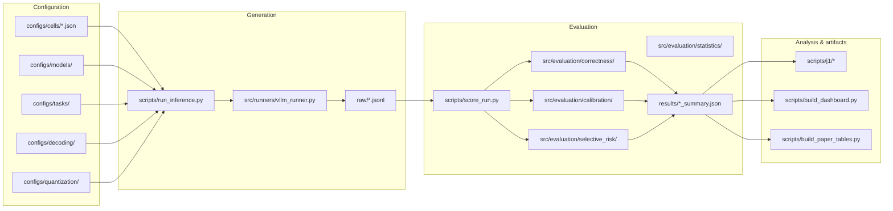
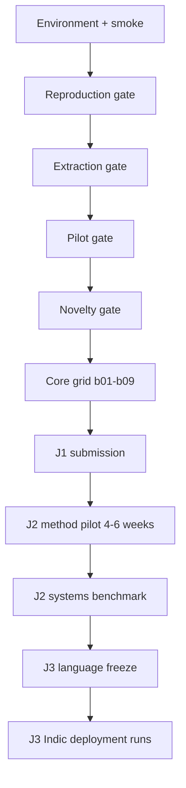
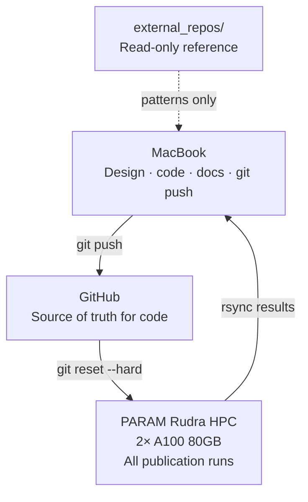

# Codebase Overview — reasoning-compression-lab

**Version:** 1.0 · **Date:** 1 July 2026  
**Roadmap alignment:** PhD Roadmap V8.2 (Evidence-Based Execution Plan)  
**Repository:** https://github.com/Manish06N/reasoning-compression-lab

This document is the canonical high-level map of the entire codebase: what it does, how pieces connect, what is implemented today, and how the three-paper thesis plan maps onto directories and scripts. For day-to-day HPC operations, start with [BEGINNER_HPC_GUIDE.md](BEGINNER_HPC_GUIDE.md). For live execution status, see [PROGRESS.md](PROGRESS.md).

**J1 status (2026-07-01):** **Engineering MVP complete; scientific validation pending** fresh HPC b01 rerun. See [J1_VALIDATION_RUNBOOK.md](J1_VALIDATION_RUNBOOK.md).

---

## 1. Purpose and research spine

### 1.1 What this repository is

`reasoning-compression-lab` is a **single research platform** for studying how compressed reasoning language models behave under real deployment conditions — not just whether pass@1 changes, but whether calibration, selective risk, seed stability, latency, memory, and cost-per-correct answer remain trustworthy.

The repo implements the shared software architecture described in PhD Roadmap V8.2 §11: one harness with paper-specific configuration folders (`papers/j1`, `papers/j2`, `papers/j3`), not three unrelated codebases.

### 1.2 Thesis title (V8.2)

> **Reliable and Cost-Efficient Deployment of Reasoning Language Models under Compression, Acceleration, and Multilingual Constraints**

### 1.3 Three-paper story

| Paper | Working title | Core question | Codebase home |
|-------|---------------|---------------|---------------|
| **J1** | Beyond Accuracy: Calibration, Selective Risk, and Statistical Reliability of Quantized Reasoning Models | Does compression change trustworthiness beyond average accuracy? | `papers/j1/`, `src/evaluation/`, HPC blocks b01–b09 |
| **J2** | From Microbenchmarks to Serving Reality: Cross-Stack Reliability of Long-Reasoning Acceleration | Do acceleration gains survive end-to-end serving? | `papers/j2/`, `src/generation/sglang/`, `scripts/j2/` |
| **J3** | Reliable and Efficient Indic Reasoning Deployment | Do deployment conclusions transfer across languages, scripts, and local hardware? | `papers/j3/`, `src/generation/llamacpp/`, `scripts/j3/` |

### 1.4 Primary claim (Paper 1 — active work)

> Deployment decisions based only on one-run accuracy can be unsafe: compression can alter confidence calibration, selective-risk ordering, and run-to-run reliability even when average accuracy changes little.

The codebase is built to produce **evidence** for that claim: immutable raw traces, paired statistics, calibration metrics, and reproducible experiment cells.

---

## 2. System architecture

### 2.1 End-to-end pipeline



**Design principle:** Raw generations are **immutable**. New extractors, calibration methods, or metrics re-score cached JSONL — they never re-run GPU inference unless explicitly requested.

### 2.2 Experiment cell model

Every experiment is an **experiment cell**: a frozen combination of model, task, quantization config, decoding profile, seed, and prompt profile.

Example cell (`configs/cells/level_b_qwen7b_bf16_math500_seed0.json`):

```json
{
  "cell_id": "level_b_qwen7b_bf16_math500_seed0",
  "model_config": "configs/models/deepseek_r1_qwen_7b.json",
  "task_config": "configs/tasks/math500.json",
  "quant_config": "bf16",
  "decoding_config": "configs/decoding/repro_qrm.yaml",
  "seed": 0,
  "prompt_profile": "sober"
}
```

Cells roll up into **execution levels** and **HPC blocks**:

| Level | Scope | Purpose |
|-------|-------|---------|
| **Level A** | Qwen-7B × {BF16, GPTQ-4} × MATH-500 × seeds 0,42–44 | Reproduction gate vs QRM literature |
| **Level B** | Qwen-7B × 5 quants × {MATH-500, GPQA, GSM8K} × seed 0 | Pilot signal before full grid |
| **Level C** | 3 models × 5 quants × 4 tasks × 5 seeds | Main publication grid |

| HPC block | GPUs | Cells | Est. wall time |
|-----------|------|-------|----------------|
| b01 | 2× A100 | BF16 Qwen-7B + BF16 Llama-8B MATH-500 | 12–24 h |
| b02 | 2× A100 | FP8 Qwen-7B + FP8 Llama-8B MATH-500 | 12–24 h |
| b03 | 2× A100 | AWQ-4 both models | 12–24 h |
| b04 | 2× A100 | GPTQ-4 both models | 12–24 h |
| b05 | 1× A100 | GPTQ-3 Qwen-7B (stress) | 12–20 h |
| b06 | 1× A100 | FP8 Qwen-7B GSM8K (n=1319) | 20–40 h |
| b07 | 1× A100 | GPQA-Diamond | 8–20 h |
| b08–b09 | 1× A100 | Qwen-1.5B scale controls | when capacity allows |

Block wiring lives in `configs/machine_split/hpc_blocks/`. Orchestration: `scripts/hpc/run_hpc_2a100_publication.sh`.

### 2.3 Publication archive layout

HPC runs write to a dated archive root (not the default `runs/` tree):

```
outputs-hpc-2a100-main-YYYY-MM-DD/
├── raw/              # Immutable inference JSONL (one file per cell)
├── scored/           # Scored JSONL (correctness + calibration fields)
├── results/          # Per-cell summary JSON
├── checkpoints/      # Resume state per cell
├── logs/             # Block and cell logs
├── metadata/         # Environment snapshots
├── manifest.json     # Block-level provenance
└── _backup/          # Mirror for disaster recovery
```

Set explicitly before a fresh run:

```bash
export QREASON_OUTPUT_ROOT=$QR/outputs-hpc-2a100-main-$(date +%Y-%m-%d)-rerun
export QREASON_FRESH_RUN=1
```

---

## 3. Directory reference

### 3.1 Top-level map

```
reasoning-compression-lab/
├── configs/          # All experiment configuration (cells, models, tasks, decoding, serving)
├── papers/           # Frozen paper protocols (J1/J2/J3 YAML)
├── prompts/          # Prompt templates (sober + QRM reproduction)
├── schemas/          # JSON Schema for raw rows, summaries, cell configs
├── src/              # Python packages (generation, evaluation, runners, metrics)
├── scripts/          # CLIs and orchestration (inference, scoring, HPC, j1/j2/j3)
├── slurm/            # PARAM Rudra SLURM job files
├── tests/            # Unit tests (34 as of 2026-07-01)
├── dashboards/       # Generated HTML dashboards
├── docs/             # All documentation
├── outputs-hpc-*/    # Publication archives on HPC scratch (manifests/summaries in git; raw JSONL not)
└── runs/             # Local/dev default output tree
```

**Not in git:** `models/`, `hf_cache/`, local `runs/`, `results/`, `logs/` (unless archived).

### 3.2 `configs/` — configuration layers

| Subdirectory | Role | Key files |
|--------------|------|-----------|
| `cells/` | Experiment cell definitions (~30 cells for Levels A/B/C + smoke) | `level_a_bf16_seed0.json`, `level_b_qwen7b_*.json`, `level_c_*.json` |
| `models/` | vLLM model paths, dtype, `enforce_eager`, max_model_len | `deepseek_r1_qwen_7b.json`, `deepseek_r1_llama_8b_*.json`, quant variants |
| `tasks/` | Dataset ID, split, prompt template reference | `math500.json`, `gpqa_diamond.json`, `gsm8k.json` |
| `decoding/` | Temperature, max_tokens, repetition_penalty | `repro_qrm.yaml` (publication), `pilot_5080.yaml` (retired local) |
| `quantization/` | Method registry (bits, group size, notes) | `registry.yaml` — bf16, fp8, awq4, gptq4, gptq3 |
| `serving/` | Backend version pins for cross-stack work | `vllm.yaml`, `sglang.yaml`, `llamacpp.yaml` |
| `machine_split/` | HPC block → cell wiring | `hpc_blocks/b01_parallel_bf16_anchors.sh`, … b09 |
| `baselines/` | QRM literature sanity bands | `qrm_literature_targets.yaml` |

### 3.3 `src/` — Python packages

#### Active V8.2 modules

| Module | Path | Responsibility | Status |
|--------|------|----------------|--------|
| **generation/vllm** | `src/generation/vllm/` | vLLM backend facade | **Active** — all J1 HPC inference |
| **generation/sglang** | `src/generation/sglang/` | SGLang backend stub | **Pilot** — J2 method gate |
| **generation/llamacpp** | `src/generation/llamacpp/` | llama.cpp backend stub | **Pilot** — J3 local transfer |
| **evaluation/correctness** | `src/evaluation/correctness/` | Answer extraction, pass@1 scoring | **Active** |
| **evaluation/calibration** | `src/evaluation/calibration/` | Brier, adaptive ECE, NLL, reliability bins | **Active** |
| **evaluation/selective_risk** | `src/evaluation/selective_risk/` | Risk-coverage curves, AURC | **Active** |
| **evaluation/statistics** | `src/evaluation/statistics/` | McNemar, cluster bootstrap, Holm | **Active** |
| **schemas** | `src/schemas/` | Provenance hashing, JSON Schema validation | **Active** |
| **profiling** | `src/profiling/` | GPU stats, VRAM snapshots, latency, cost model | **Active** |

#### Legacy modules (still used by HPC entrypoints)

| Module | Path | Notes |
|--------|------|-------|
| **runners** | `src/runners/` | `vllm_runner.py` (core inference), config utils, checkpoints, resume guard |
| **extraction** | `src/extraction/` | Math and GPQA answer parsers |
| **metrics** | `src/metrics/` | Legacy scoring re-exports; cost-per-correct, Pareto, trace length |
| **stats** | `src/stats/` | Seed variance utilities |

The V8.2 re-engineering kept HPC CLIs stable (`run_inference.py`, `score_run.py`) while introducing canonical evaluation modules under `src/evaluation/`.

### 3.4 `papers/` — frozen protocols

Each paper has a YAML protocol that records primary endpoints, gates, and deliverables independent of code:

| File | Contents |
|------|----------|
| `papers/j1/protocol.yaml` | Primary endpoints (pass@1, Brier, AURC, cost-of-pass), reproduction/pilot gates, statistics plan |
| `papers/j2/protocol.yaml` | Method-selection pilot candidates (EAGLE, SpecReason, KIVI, KVQuant, stack transfer), metrics, fallback |
| `papers/j3/protocol.yaml` | Language matrix ref, Indic benchmarks, local transfer layer, deliverables |
| `papers/j3/language_matrix.yaml` | Six core languages + code-mixed conditions + compression disparity layer |
| `papers/j1/audit/sampler.py` | Stratified audit sampling for manual extraction review |

### 3.5 `prompts/` — two prompt profiles

| Profile | Files | Used for |
|---------|-------|----------|
| **reproduction** | `qrm_math500.txt`, `qrm_gsm8k.txt` | Level A reproduction gate — matches QRM COLM 2025 baseline |
| **sober** | `math500.txt`, `gsm8k.txt`, `gpqa_diamond.txt` | Level B/C main grid — longer sober-reasoning template |

**Important:** Comparing pass@1 across profiles confounds prompt and quantization. Always compare within the same `prompt_profile`.

### 3.6 `schemas/` — data contracts

| Schema | Purpose | Required fields (summary) |
|--------|---------|---------------------------|
| `raw_response.v1.json` | One inference row | `id`, `prompt`, `completion`, `cell_id`, `task`, `seed`, `run_id`, `git_commit`, `config_hash` |
| `summary.v1.json` | Scored cell summary | `cell_id`, `n`, `pass_at_1`, optional calibration/economics fields |
| `cell_config.v1.json` | Cell config validation | `cell_id`, model/task/quant references |

Provenance fields are populated by `src/schemas/provenance.py` at inference time.

### 3.7 `scripts/` — command-line tools

#### Core pipeline (do not rename)

| Script | Role |
|--------|------|
| `run_inference.py` | Main inference CLI — loads cell config, runs vLLM, writes raw JSONL with checkpoints |
| `score_run.py` | Scores raw JSONL → scored JSONL + summary JSON (correctness, calibration, selective risk) |
| `smoke_test.py` | Quick end-to-end validation |
| `verify_decoding_params.py` | Preflight: confirms decoding YAML reaches vLLM SamplingParams |

#### Paper 1 (J1)

| Script | Role |
|--------|------|
| `j1/compare_configs.py` | Paired McNemar + cluster bootstrap + Holm between two scored runs |
| `j1/aggregate_seeds.py` | Multi-seed aggregation and rank-reversal detection |
| `j1/sample_audit.py` | Draw stratified audit sample for manual extraction review |
| `j1/export_conference_cache.py` | Export C1 conference derivative cache |
| `compare_qrm_baseline.py` | Sanity check pass@1 vs QRM literature bands |
| `run_inference_multisample.py` | maj@5 runs for calibration pilot |
| `compute_calibration.py` | Calibration from multisample outputs |
| `build_pareto_frontier.py` | Cost-per-correct Pareto analysis |
| `build_paper_tables.py` | Aggregate archive summaries into paper tables |
| `build_dashboard.py` | Static HTML dashboard from archive |
| `export_parquet.py` | Parquet export for offline analysis |

#### Paper 2 (J2)

| Script | Role |
|--------|------|
| `j2/run_method_pilot.py` | Method-selection pilot manifest generator |

#### Paper 3 (J3)

| Script | Role |
|--------|------|
| `j3/preflight_indic.py` | Indic benchmark and language-matrix preflight |
| `j3/run_local_transfer.py` | RTX 5080 / llama.cpp transfer pilot |

#### HPC orchestration

| Script | Role |
|--------|------|
| `hpc/run_hpc_2a100_publication.sh` | **Main publication driver** — blocks b01–b09 |
| `hpc/submit_hpc_blocks.sh` | SLURM submission wrapper |
| `hpc/07_preflight_publication.py` | CPU preflight: cells, QRM decoding, model files |
| `hpc/09_assert_fresh_archive.sh` | Blocks accidental resume into bad archives |
| `hpc/01_gpu_check.sh` … `05_score_level_a.sh` | Gate scripts (GPU, download, smoke, Level A) |
| `hpc/08_download_gptq4_models.sh` | GPTQ-4 weight gate for b04 |
| `macbook/rsync_from_hpc.sh` | Pull HPC-only changes to MacBook |
| `macbook/sync_results_from_hpc.sh` | Pull results archives |

#### Local (5080 — retired for publication)

Scripts under `scripts/local/` remain for historical reference. **All paper numbers run on HPC A100 only.**

### 3.8 `tests/`

```bash
python -m pytest tests/ -q   # expect 34 passed
```

| Test file | Coverage |
|-----------|----------|
| `test_config_and_tasks.py` | Cell config loading, task manifests |
| `test_math_extractor.py` | Answer extraction edge cases |
| `test_sampling_params.py` | Decoding YAML → vLLM params |
| `test_gpu_stats.py` | Profiling utilities |
| `test_v82_schemas.py` | JSON Schema validation |
| `test_v82_statistics.py` | McNemar, bootstrap, Holm |
| `test_v82_architecture.py` | Module imports and layout |
| `test_resume_guard.py` | Resume-into-bad-archive protection |
| `test_external_repos_integration.py` | External repo pin references |

### 3.9 `slurm/`

| File | Purpose |
|------|---------|
| `hpc_2a100_b01_parallel.slurm` | 2-GPU parallel block submission |
| `hpc_2a100_b07_gpqa.slurm` | GPQA block (after HF access gate) |
| `smoke_test_quick_exclusive.slurm` | Exclusive-GPU smoke test |
| `run_level_a_bf16.slurm` | Level A full run |
| `download_model.slurm` | Model download job |

PARAM Rudra rules: `--partition=gpu`, `--gres=gpu:1`, **no** `#SBATCH --mem`, vLLM 0.8.5, `enforce_eager: true`.

---

## 4. Evaluation stack (V8.2 §6.5–6.6)

### 4.1 Correctness

- **Tasks:** MATH-500, GPQA-Diamond, GSM8K (LiveCodeBench planned)
- **Extraction:** `src/extraction/math_extractor.py`, `gpqa_extractor.py`
- **Metrics:** pass@1, parse failure rate, truncation rate
- **Multisample:** maj@5 via `run_inference_multisample.py` for calibration reference

### 4.2 Calibration

Implemented in `src/evaluation/calibration/`:

| Metric | Module | Notes |
|--------|--------|-------|
| Brier score | `metrics.py` | Primary endpoint (J1) |
| Adaptive ECE | `reliability.py` | Secondary |
| NLL | `reliability.py` | Secondary |
| Reliability diagram bins | `reliability.py` | For plotting |
| AURC / AUROC | via `src/metrics/calibration.py` | Selective prediction |

**Calibration confidence (fail-closed):** `score_run.py` does **not** treat parse success as publication confidence. Use `--skip-calibration` for repro scoring; `--require-calibration` before analysis; maj@5 or logprobs for Brier/AURC claims. See [KNOWN_ISSUES.md](KNOWN_ISSUES.md) §4.

### 4.3 Selective risk

`src/evaluation/selective_risk/curves.py` computes risk-coverage curves and AURC from scored rows.

### 4.4 Statistics (pre-registered for J1)

| Analysis | Implementation | Roadmap reference |
|----------|----------------|-------------------|
| Paired correctness | `mcnemar.py` | V8.2 §13 |
| Metric uncertainty | `bootstrap.py` (cluster by item ID) | V8.2 §13 |
| Multiple comparisons | `holm.py` | V8.2 §13 |
| Config comparison CLI | `scripts/j1/compare_configs.py` | V8.2 §6.6 |

### 4.5 Serving and economics

| Metric | Source |
|--------|--------|
| TTFT, TPOT, latency | `vllm_runner.py` + profiling |
| Peak VRAM | `src/profiling/gpu_stats.py` |
| Cost-of-pass | `src/metrics/cost_per_correct.py` |
| Pareto frontier | `scripts/build_pareto_frontier.py` |

---

## 5. Models, quantization, and tasks

**Scope policy:** [MODEL_SCOPE_DECISION.md](MODEL_SCOPE_DECISION.md) — in scope / out of scope / gated extensions for J1.

### 5.1 Model roster

| Model | Role | Config prefix |
|-------|------|---------------|
| DeepSeek-R1-Distill-Qwen-7B | **Primary** — first experiment, reproduction anchor | `deepseek_r1_qwen_7b` |
| DeepSeek-R1-Distill-Llama-8B | Cross-architecture comparison | `deepseek_r1_llama_8b` |
| DeepSeek-R1-Distill-Qwen-1.5B | Scale control / HPC b08–b09 | `deepseek_r1_qwen_15b` |
| Qwen-14B / Qwen3 | Ambitious extension only after 7B pilot | not wired yet |

### 5.2 Quantization grid

From `configs/quantization/registry.yaml`:

| Config ID | Method | Bits | Role |
|-----------|--------|------|------|
| `bf16` | none | 16 | Baseline |
| `fp8` | compressed-tensors | 8 | Pre-quantized HF FP8 (RedHatAI) |
| `awq4` | AWQ | 4 | HF AWQ W4G128 |
| `gptq4` | GPTQ | 4 | QRM HF GPTQ collection W4G128 |
| `gptq3` | GPTQ | 3 | Bit-width stress test |

### 5.3 Tasks

| Task | Dataset | n | Prompt profile |
|------|---------|---|----------------|
| MATH-500 | HuggingFaceH4/MATH-500 | 500 | sober / reproduction |
| GPQA-Diamond | Idavidrein/gpqa (gated) | subset | sober |
| GSM8K | openai/gsm8k test | 1319 | sober / reproduction |

---

## 6. Execution gates and decision flow

The codebase enforces the V8.2 gate-based execution plan:



| Gate | Pass condition | Codebase support |
|------|----------------|------------------|
| **Reproduction** | BF16/GPTQ-4 pass@1 within ±5% of QRM | `compare_qrm_baseline.py`, Level A cells seeds 42–44, `prompt_profile: reproduction` |
| **Extraction** | ≤ acceptable manual audit error on 50 samples | `scripts/j1/sample_audit.py`, `papers/j1/audit/` |
| **Pilot** | 3–5 seed CIs + at least one reliability signal | `j1/aggregate_seeds.py`, Level B cells |
| **Novelty** | No competing paper claims same joint study | Manual — template in roadmap Appendix C |
| **Scale** | 7B/8B story stable before 14B/32B | Config policy in `papers/j1/protocol.yaml` |

**Current blocker (2026-07-01):** Publication numbers blocked until fresh HPC b01 rerun. Archive `outputs-hpc-2a100-main-2026-06-29` is diagnostic only (decoding bug — 7% pass@1). See [KNOWN_ISSUES.md](KNOWN_ISSUES.md).

---

## 7. Paper-by-paper implementation status

### 7.1 Paper 1 (J1) — **engineering MVP complete; validation pending**

| Component | Status |
|-----------|--------|
| Protocol YAML | ✅ `papers/j1/protocol.yaml` + `amendments.yaml` |
| Minimum publishable grid | ✅ 15 cells — `papers/j1/publication_matrix.yaml` |
| Full Level C (300 cells) | ❌ Aspirational — not generated yet |
| Inference + scoring pipeline | ✅ Production on vLLM |
| Fail-closed calibration | ✅ `src/evaluation/calibration/confidence.py` |
| Statistics (McNemar, bootstrap, Holm) | ✅ |
| HPC block grid b01–b09 | ✅ Wired (seed 0) |
| Reproduction seeds 42–44 | ✅ Cell configs exist |
| Manual audit tooling | ✅ |
| **Fresh HPC publication runs** | ⏳ **Blocker** — see [J1_VALIDATION_RUNBOOK.md](J1_VALIDATION_RUNBOOK.md) |
| Valid calibration numbers | ⏳ Requires maj@5 or logprobs after repro |
| LiveCodeBench integration | ❌ Not yet wired |

**Primary endpoints (pre-registered):** pass@1, Brier, AURC, cost-of-pass ratio.

### 7.2 Paper 2 (J2) — **scaffolded, method gate pending**

| Component | Status |
|-----------|--------|
| Protocol YAML | ✅ `papers/j2/protocol.yaml` |
| SGLang backend stub | ✅ Pilot only |
| Serving config pins | ✅ `configs/serving/sglang.yaml` |
| Method pilot manifest script | ✅ `scripts/j2/run_method_pilot.py` |
| EAGLE / SpecReason / KIVI integration | ❌ Awaiting 4–6 week pilot after J1 |
| Load testing harness | ❌ Not built |
| Trained draft/verifier artifact | ❌ Not started |

**Selection rule:** One main mechanism + one reference mechanism after pilot gate. Pre-approved fallback: controlled failure-transfer paper.

### 7.3 Paper 3 (J3) — **scaffolded, blocked on J1**

| Component | Status |
|-----------|--------|
| Protocol YAML + language matrix | ✅ |
| llama.cpp backend stub | ✅ Pilot only |
| Indic preflight script | ✅ `scripts/j3/preflight_indic.py` |
| Local transfer script | ✅ `scripts/j3/run_local_transfer.py` |
| Indic benchmark integration | ❌ External repos cloned; harness not wired |
| Human evaluation protocol | ❌ Reviewer recruitment pending |
| RTX 5080 local transfer | ⏳ J3 only — see [HARDWARE_POLICY.md](HARDWARE_POLICY.md) |

---

## 8. Infrastructure and division of labor



| Machine | Role | Key paths |
|---------|------|-----------|
| **MacBook** | Design, scripts, configs, writing, pre-push tests, rsync hub | `/Users/manish/Projects/2026/paper 1/reasoning-compression-lab` |
| **HPC (PARAM Rudra)** | Model storage, vLLM inference, quantization, all paper numbers | `$QR=/scratch/manishn_iitp/reasoning-compression-lab` |
| **5080** | Not used for J1/J2 paper numbers; **J3 local transfer only** |
| **external_repos/** | Read-only clones of QRM, vLLM baselines, J2/J3 references | `../external_repos/` — never develop here |

**Sync protocol:** HPC cannot push to GitHub. MacBook pushes → HPC `git reset --hard origin/main`. See [RUNBOOK.md](RUNBOOK.md).

**Validated HPC stack:** Python 3.11, PyTorch 2.6+cu124, vLLM 0.8.5, conda env `qreason`.

---

## 9. External reference codebases

Adoption order from V8.2 §20. All live in `../external_repos/` (read-only):

| Stage | Repository | Repo use in this codebase |
|-------|------------|---------------------------|
| J1 reproduction | `Quantized-Reasoning-Models` | Reproduction anchor; QRM prompts and baseline bands |
| J1 serving | `vllm` | Primary backend (pinned 0.8.5) |
| J1 evaluation | `lighteval`, `lm-evaluation-harness` | Task definitions; optional sanity cross-check |
| J1 code benchmark | `LiveCodeBench` | Planned — not wired |
| J2 speculation | `EAGLE`, `SpecForge`, `specreason` | Method pilot candidates |
| J2 KV cache | `KIVI`, `KVQuant`, `QuaRot` | Alternative pilot paths |
| J2 serving | `sglang` | Second backend |
| J3 local | `llama.cpp` | GGUF / RTX transfer |
| J3 benchmarks | `IndicIFEval`, `IndicParam`, `indic-gen-bench` | Language evaluation layer |

Record pins: `scripts/record_external_repo_pins.sh`.

---

## 10. Data immutability and provenance

Every raw row should carry (V8.2 §11.1):

| Field group | Examples |
|-------------|----------|
| **Provenance** | `run_id`, `timestamp`, `git_commit`, `config_hash`, `model_revision` |
| **Environment** | `backend_version`, GPU stats, decoding params |
| **Prompt** | `task`, `id`, `prompt_template_version`, `input_text_hash`, `seed` |
| **Output** | `completion`, `finish_reason`, token counts |
| **Performance** | `latency_sec`, `time_to_first_token_sec`, `peak_vram_gb` |

**Resume guard:** `src/runners/resume_guard.py` prevents resuming into JSONL from incompatible git commits, config hashes, or missing decoding fields. Combined with `09_assert_fresh_archive.sh`, this blocks the June-29 bad archive trap.

**Re-scoring:** `scripts/rescore_archive.py` re-runs scoring on existing raw JSONL without GPU.

---

## 11. Documentation map

| Audience | Start here |
|----------|------------|
| **New contributor — understand the system** | **This file** → [REPO_MAP.md](REPO_MAP.md) → [V8_2_ARCHITECTURE.md](V8_2_ARCHITECTURE.md) |
| **Operator — run experiments on HPC** | [BEGINNER_HPC_GUIDE.md](BEGINNER_HPC_GUIDE.md) → [HPC_2A100_PLAN.md](HPC_2A100_PLAN.md) |
| **Research — paper scope and claims** | [PAPER1_DESIGN.md](PAPER1_DESIGN.md) → [MODEL_SCOPE_DECISION.md](MODEL_SCOPE_DECISION.md) → `papers/j1/protocol.yaml` |
| **Thesis — full 24-month plan** | PhD Roadmap V8.2 (external) + [PHD_ROADMAP.md](PHD_ROADMAP.md) (V5–V7, historical) |
| **Live status** | [PROGRESS.md](PROGRESS.md) → [progress.md](../progress.md) → [CHANGELOG.md](../CHANGELOG.md) |
| **Traps and bugs** | [KNOWN_ISSUES.md](KNOWN_ISSUES.md) |
| **V8.2 implementation checklist** | [plans/2026-07-01-v82-reengineering.md](plans/2026-07-01-v82-reengineering.md) |

---

## 12. Quick start commands

### Local validation (MacBook, no GPU)

```bash
python -m pytest tests/ -q
python scripts/verify_decoding_params.py
python scripts/hpc/07_preflight_publication.py   # skips model checks if absent
```

### Single cell (any GPU machine)

```bash
python scripts/run_inference.py --cell-config configs/cells/level_a_bf16_seed0.json
python scripts/score_run.py --input runs/raw/level_a_bf16_seed0.jsonl
```

### HPC publication block

```bash
export QR=/scratch/$USER/reasoning-compression-lab
cd $QR && git fetch origin && git reset --hard origin/main
conda activate qreason

export QREASON_OUTPUT_ROOT=$QR/outputs-hpc-2a100-main-$(date +%Y-%m-%d)-rerun
export QREASON_FRESH_RUN=1
bash scripts/hpc/run_hpc_2a100_publication.sh b01_parallel_bf16_anchors
```

### Post-run analysis

```bash
python scripts/compare_qrm_baseline.py --summary $QREASON_OUTPUT_ROOT/results/level_a_bf16_seed0_summary.json
python scripts/j1/compare_configs.py --baseline .../scored/bf16.jsonl --variant .../scored/gptq4.jsonl
python scripts/build_paper_tables.py --archive $QREASON_OUTPUT_ROOT
python scripts/build_dashboard.py --archive $QREASON_OUTPUT_ROOT
```

---

## 13. Alignment summary: roadmap V8.2 ↔ codebase

| Roadmap section | Codebase realization | Maturity |
|-----------------|---------------------|----------|
| §6 Paper 1 protocol | `papers/j1/protocol.yaml`, Levels A/B/C, b01–b09 | **Implemented** — runs pending |
| §7 Conference Paper 1 | `j1/export_conference_cache.py`, `aggregate_seeds.py` | **Scaffolded** |
| §8 Paper 2 benchmark-first | `papers/j2/protocol.yaml`, SGLang stub, method pilot script | **Scaffolded** |
| §10 Paper 3 Indic | `papers/j3/`, language matrix, llama.cpp stub | **Scaffolded** |
| §11 Shared software architecture | Single repo with `configs/`, `papers/`, `src/evaluation/` | **Implemented** |
| §11.1 Response schema | `schemas/raw_response.v1.json`, provenance module | **Implemented** |
| §13 Statistical plan | `src/evaluation/statistics/`, `j1/compare_configs.py` | **Implemented** |
| §15 First 90 days | HPC gates 1–5, preflight scripts, smoke tests | **In progress** — b01 rerun blocked |
| §20 Codebase registry | `external_repos/`, pin recorder script | **Documented** |

---

## 14. Non-goals (explicit scope boundaries)

Per V8.2 and project policy, this codebase does **not**:

- Invent new quantization or speculative-decoding algorithms (measurement and systems evaluation only)
- Run full RLHF/GRPO training programmes
- Host custom serving frameworks (uses vLLM/SGLang/llama.cpp)
- Expand to 32B/70B before the 7B/8B story is stable
- Evaluate 22+ Indic languages without native-speaker collaborators
- Use RTX 5080 numbers in **J1/J2** manuscripts (HPC-only for those papers)

---

## 15. Glossary

| Term | Meaning in this repo |
|------|---------------------|
| **Cell** | One experiment: model × task × quant × seed × prompt profile |
| **Block** | HPC SLURM job grouping 1–2 parallel cells (b01–b09) |
| **Archive** | Dated `outputs-hpc-2a100-main-*` directory with raw/scored/results |
| **Profile** | Prompt template set: `reproduction` (QRM) or `sober` (main grid) |
| **Gate** | Decision checkpoint that must pass before expanding scope |
| **AURC** | Area under the risk-coverage curve (selective prediction) |
| **Cost-of-pass** | Economic metric: cost to obtain one correct answer at a risk threshold |
| **QRM** | Quantized-Reasoning-Models (COLM 2025 reproduction baseline) |

---

*This overview reflects the repository state as of 1 July 2026. Update when gates pass, J2 method is selected, or J3 benchmarks are wired.*
