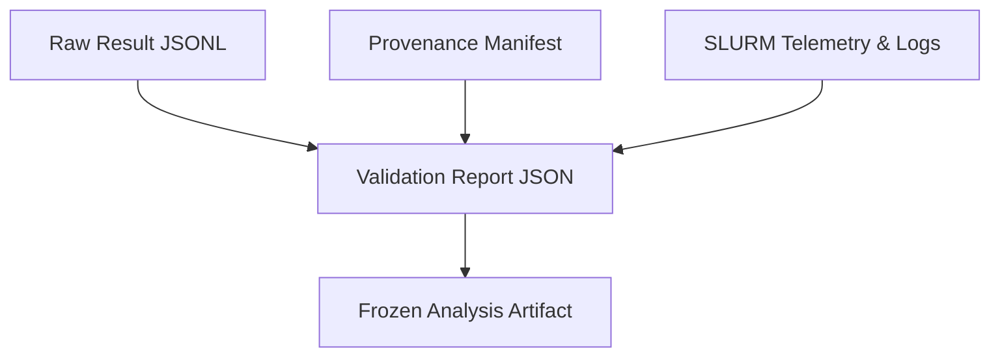

# Experimental Parameters, Output Audit, and Observability Matrix

**Project:** Reasoning Compression Lab (`reasoning-compression-lab`)  
**Date:** 2026-08-14  
**Target:** Paper 1 Publication Readiness (Reliability, Cost, and Quantization Frontier for Reasoning Models)  
**Related Documents:** [docs/PUBLICATION_READINESS.md](PUBLICATION_READINESS.md) · [docs/plans/2026-08-14-publication-recovery.md](plans/2026-08-14-publication-recovery.md) · [TODO_LIST.md](../TODO_LIST.md)

---

## 1. Master Output Inventory & Usability Audit

A comprehensive census of all outputs produced across the project history:

| Output Directory / Archive | Model(s) & Quantization | Task & Samples ($n$) | Seed | Environment & Engine | Key Result / Summary | Usability Classification | Role in Manuscript |
|---|---|---|---|---|---|---|---|
| **`outputs-hpc-qrm-official-fp8-full-2026-08-13`** | `Qwen-7B-FP8` & `Llama-8B-FP8` | MATH-500 ($n=500$) | 42 | `qrm-official` (vLLM 0.7.0) | Qwen: **94.4%** (472/500), Llama: **89.0%** (445/500) | ✅ **USABLE** | **Appendix / Control Baseline** (reproduces public model cards; not a causal claim without matched BF16). |
| **`outputs-hpc-qrm-official-fp8-validation-2026-08-13`** | `Qwen-7B-FP8` & `Llama-8B-FP8` | MATH-500 ($n=10$) | 42 | `qrm-official` (vLLM 0.7.0) | Qwen: **10/10 (100%)**, Llama: **10/10 (100%)**, 0% trunc | ✅ **USABLE** | **Preflight Gate** (verifies FP8 weights do not loop on official stack). |
| **`outputs-hpc-qrm-official-2026-07-06`** (Job 87302) | `Qwen-7B-BF16` | MATH-500 ($n=10$) | 42 | `qrm-official` (vLLM 0.7.0) | **10/10 (100%)**, 0% trunc, 0 loops | ✅ **USABLE** | **Protocol Anchor** (verifies prompt template and decoding settings). |
| **`outputs-hpc-phase0-smoke-2026-08-14`** (Active) | `Qwen-7B-BF16` & `Llama-8B-BF16` | MATH-500 ($n=3$) | 42 | `qrm-official` (vLLM 0.7.0) | Qwen: **3/3 (100%)**, 0% trunc, passed validator | ✅ **USABLE** | **Phase 0 Observability Smoke Test**. |
| **`outputs-hpc-2a100-main-2026-07-03`** (July b01) | `Llama-8B-BF16` & `Qwen-7B-BF16` | MATH-500 ($n=500$/$410$) | 0 | `qreason` (vLLM 0.8.5) | Llama: **19.6%** (58% trunc); Qwen: **~7%** (94.1% trunc) | ⚠️ **USABLE** | **Track B Serving Stack Diagnostic** (proves silent truncation failure under modern vLLM 0.8.5). |
| **`outputs-hpc-diag-pathc-2026-07-05`** | `Qwen-7B-BF16` & `Llama-8B-BF16` | MATH-500 ($n=20$) | 42 | `qreason` (vLLM 0.8.5) | Pass@1: **10–15%**, Truncation: **75–90%** | ⚠️ **USABLE** | **Diagnostic Evidence** (proves modern stack loops even with strict QRM prompt). |
| **`outputs-hpc-2a100-main-2026-08-13`** | `Qwen-7B-FP8` & `Llama-8B-FP8` | MATH-500 ($n=10$) | 0 | `qreason` (vLLM 0.8.5) | Repetition loops, 80% truncation | ❌ **UNUSABLE** | **Superseded / Aborted**. |
| **`outputs-hpc-diag-v0-fp8-2026-08-13`** | `Qwen-7B-FP8` & `Llama-8B-FP8` | MATH-500 ($n=2$) | 0 | `qreason` (vLLM 0.8.5 V0) | 32k repetition loops | ❌ **UNUSABLE** | **Failed Probe** (disabling V1 engine alone does not resolve loops). |

---

## 2. Experimental Parameters & Hyperparameter Architecture

All experiments conducted under **Protocol P1-2026-08** record and enforce the following exact parameters:

### A. Model & Checkpoint Configurations
* **Primary Model Anchors:**
  1. `DeepSeek-R1-Distill-Qwen-7B`
  2. `DeepSeek-R1-Distill-Llama-8B`
* **Quantization Formats:**
  * `BF16` (Full precision baseline)
  * `FP8` (Compressed checkpoints; executed via Marlin weight-only fallback W8A16 on A100)
  * `AWQ-4` (4-bit activation-aware weight quantization)
  * `GPTQ-4` (4-bit second-order error compensation quantization)

### B. Prompting Protocol
* **Prompt Type:** Zero-shot step-by-step reasoning prompt.
* **System Prompt:** `None` (empty to prevent conversational bias).
* **Assistant Prefix:** `<｜Assistant｜><think>\n` (forces direct entry into reasoning mode).
* **Instruction String:** `"Please reason step by step, and put your final answer within \\boxed{}."`

### C. Sampling & Decoding Hyperparameters
* **Temperature:** `0.6`
* **Top-p ($p$):** `0.95`
* **Top-k ($k$):** `None` (default)
* **Repetition Penalty:** `1.0` (Disabled / None)
* **Max Generation Tokens (`max_new_tokens`):** `32,768`
* **Max Model Input Length (`max_model_len`):** `32,768`
* **Batch Size:** `1` (sequential evaluation per prompt to prevent batching length distortions)
* **Sampling Seeds:**
  * Pilot Seeds: `42`, `43`, `44`
  * Headline Confirmatory Seeds: `42`, `43`, `44`, `45`, `46`

### D. Serving Engine & Hardware Runtime Settings
* **Inference Engine:** `vLLM==0.7.0` (pinned fork in `qrm-official` environment)
* **Execution Mode:** `--enforce-eager` (Required: eliminates Triton JIT linker failures on HPC nodes)
* **KV Cache Dtype:** `auto`
* **Prefix Caching:** `False`
* **Chunked Prefill:** `False`
* **Tensor Parallelism:** `1`
* **Pipeline Parallelism:** `1`
* **GPU Memory Utilization:** `0.75` (safely restricts VRAM allocation to 60 GB on 80 GB A100)
* **Hardware:** NVIDIA A100-PCIE-80GB (Nodes `ragpu003–008`, `racn115–116`)
* **SLURM Parameters:** `--gres=gpu:1` (non-exclusive), `--cpus-per-task=16`, 48h walltime

---

## 3. Parameter Recording & Schema Observability

For every completed inference step, the following fields are recorded across the raw results, validation summaries, and provenance manifests:

### Parameter Field Inventory

| Layer | Field Name | Type | Description |
|---|---|---|---|
| **Provenance** | `model_path` | `str` | Full filesystem path to model checkpoint |
| | `dataset_id` | `str` | Dataset identifier (`HuggingFaceH4/MATH-500`) |
| | `dataset_revision` | `str` | Exact dataset commit SHA (`6e4ed1a2a...`) |
| | `prompt_template` | `str` | Exact prompt template formatting |
| | `seed` | `int` | Random seed used for generation (`42`) |
| | `timestamp` | `str` | UTC ISO-8601 execution timestamp |
| | `slurm_job_id` | `str` | SLURM cluster allocation ID |
| **Output Data** | `full_prompt` | `str` | Full formatted prompt sent to vLLM |
| | `generated_text` | `str` | Full completion text including `<think>` reasoning |
| | `gold` | `list[str]` | Ground-truth solution and final answer |
| | `metrics.extractive_match` | `float` | `1.0` if extracted LaTeX boxed answer matches gold, else `0.0` |
| **Observability** | `completion_tokens` | `int` | Exact number of generated tokens (via tokenizer) |
| | `boxed` | `bool` | True if output contains `\boxed{...}` |
| | `hit_token_limit` | `bool` | True if `completion_tokens >= max_new_tokens` (32,768) |
| | `max_consecutive_word_run`| `int` | Longest consecutive repeated word run (loop detector) |
| | `repetition_flag` | `bool` | True if word run $\ge 20$ (pathological degeneration) |

---

## 4. Multi-Tier Validation Rules

Every experiment output is validated against three distinct tiers:

1. **`integrity_pass`:**
   * 100% of rows present ($500/500$ for full run, $3/3$ for smoke).
   * All rows contain non-null `full_prompt`, `generated_text`, and numeric `metrics`.
   * Model and dataset hashes match pinned values.
2. **`quality_warnings`:**
   * `token_limit_hits > 0` (flags near-cap completions).
   * `repetition_rows > 0` (flags degeneration loops).
   * `boxed_rate < 0.95` (flags answer formatting failures).
3. **`publication_gate`:**
   * Matched BF16 control present under identical protocol hash.
   * Minimum 3 seeds (pilot) or 5 seeds (headline).
   * Manual audit completed for 100% of flagged traces and $\ge 200$ stratified samples.
